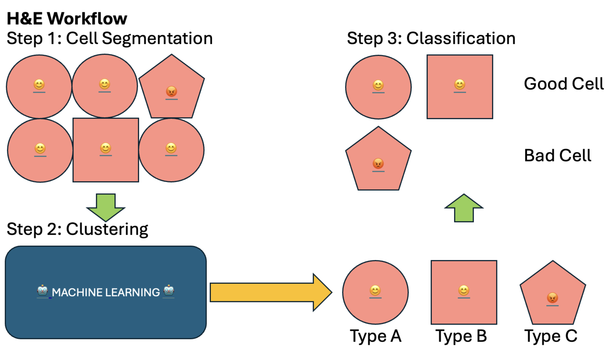
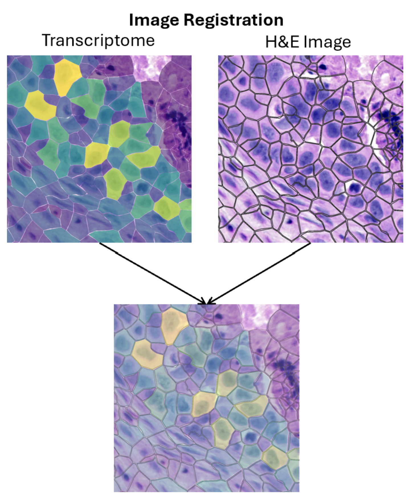

# A\*Star - Spatial Omics Hackathon

## Problem Statement

Leverage AI to fuse RNA data with complementary histological insights and/or cell segmentation derived from H&E images.

## Aim

To find out if clusters based on transcriptome expression align with clusters based on histological data.

## Significance

Various methods are used to identify cancer cells, such as morphological identification and transcriptome expression. However, each of these methods has its limitations. To maximise the accuracy of cancer cell identification, machine learning will be used to create a robust meta-learning approach that integrates results from different methods to achieve the highest possible accuracy.

## Methodology

To analyse cells by morphology, H&E images extracted from Xenium data will be turned into numbers and clustered by a consensus machine learning algorithm. The transcriptomic data will also be fed into a clustering algorithm to analyse them by gene expression. Each cell will then be annotated with its morphological cluster and transcriptomic cluster.

1. Transcriptome Analysis:
    - Classify cell types based on transcriptome expression (use the 10X workflow, refer to Visium and Xenium data).
2. H&E Insight Acquisition (Morphology):
    - 
    - Cell Segmentation (use an existing library)
    - Apply Machine Learning.
    - Classification (manual work,
      based on literature)
3. Image Registration:
    - 
    - Compare cell classifications based on transcriptome expression (Step 1) and morphological features (Step 2).
    - We hope that the two classifications will be aligned, i.e., the cells are expressing the genes they’re supposed to.
    - If not, that will be quite problematic.

## Intended Output

Single cells will be annotated with cell type as classified by gene expression and cell type as classified by morphology. Cells with incongruent type classifications will be flagged for further analysis.

## Team

-   Javian Ng
-   Cheng Jun Yuan
-   Lin Qiyu
-   Russell Yap
